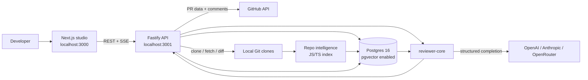
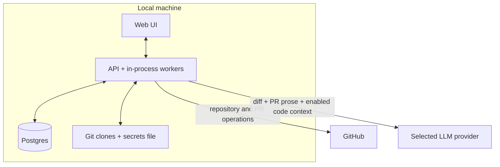
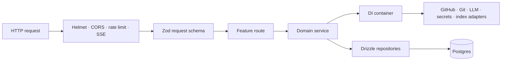
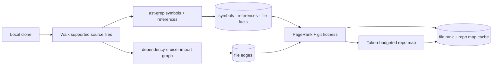
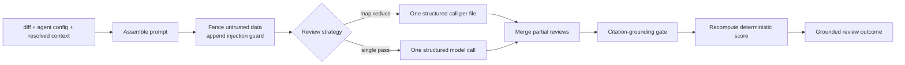

# DevDigest Architecture Overview

> **Document role:** Canonical curated explanation of how the current DevDigest
> system works.
> **Last verified:** 2026-09-17 against `main` at
> `c6af1e452969dcad9f451e29c0a4e461a41405ae`.
> Product identity is owned by
> [`docs/ai-context/00_PRODUCT_IDENTITY.md`](../ai-context/00_PRODUCT_IDENTITY.md),
> and capability status by
> [`docs/ai-context/01_PRODUCT_BOUNDARY.md`](../ai-context/01_PRODUCT_BOUNDARY.md).

## Purpose

DevDigest is a local-first AI pull-request review studio.

Its current operational capabilities centre on:

- connecting GitHub repositories;
- cloning and indexing repositories locally;
- importing and browsing pull requests;
- configuring specialised reviewer agents;
- executing one or all enabled AI reviewer configurations;
- grounding findings against actual changed lines;
- persisting reviews, findings, run status, and execution traces;
- accepting or dismissing findings locally;
- authoring inline review comments that are posted to GitHub.

Weekly digests, evaluation, persistent memory, CI export, first-class skills,
plugins, dashboards, onboarding, and related capabilities currently exist
primarily as schema, contracts, prompt slots, or other scaffolding for later
course stages. They are not part of the operational architecture unless listed
as operational in the product-boundary document.

## System context



The web application and API run on the host. Only Postgres is containerised by
the repository's default Docker Compose configuration.

## Trust and data-movement boundary



“Local-first” describes ownership and placement of application state. It does
not mean inference is local or that reviewed code never leaves the machine.

## Solution structure

DevDigest is a collection of independent packages rather than a package-manager
workspace. Each package owns its dependencies and lockfile; shared source is
consumed through TypeScript path aliases or vendored source.

| Path | Runtime role | Main technology |
| --- | --- | --- |
| `client/` | Browser studio, navigation, PR list/detail, agent editor, Settings, live run views | Next.js 15, React 19, TanStack Query |
| `server/` | HTTP API, persistence, GitHub/Git/LLM adapters, background work, repo indexing, review orchestration | Fastify 5, Drizzle ORM, Postgres |
| `reviewer-core/` | Pure review pipeline from prepared diff/context to structured grounded review | TypeScript, Zod contracts, injected `LLMProvider` |
| `e2e/` | Deterministic browser journeys against the real seeded stack | agent-browser runner |
| `server/src/vendor/shared/` | Shared Zod contracts and adapter interfaces used by the API and reviewer | TypeScript/Zod |
| `client/src/vendor/shared/` | Client-side mirror of shared contracts | TypeScript/Zod |

The API composition root is
[`server/src/app.ts`](../../server/src/app.ts). It creates the dependency
container, configures security/transport plugins, installs error handling, and
registers only the feature modules exported by
[`server/src/modules/index.ts`](../../server/src/modules/index.ts).

The active modules are:

- settings;
- repositories;
- pull requests;
- manual polling;
- workspace;
- agents;
- reviews and runs;
- repository intelligence.

## Runtime request path



The dependency container lazily constructs production adapters and allows tests
to replace them with mocks. Shared Zod definitions are used for request/output
contracts and for structured model responses.

## End-to-end product flow

### 1. Configuration and identity

The application currently uses `LocalNoAuthProvider`. Every request resolves to
the seeded `you@local` user and `default` workspace. Workspace IDs still scope
domain queries so the persistence model can evolve beyond local single-user
mode.

Settings are split into:

- non-secret preferences stored as key/value rows in Postgres;
- API keys stored in `~/.devdigest/secrets.json`, with environment variables as
  fallback.

The secret-status endpoint returns booleans only. When the UI supplies a new key,
the server stores it, invalidates cached provider clients, and performs a small
live connection test.

### 2. Repository registration and cloning

`POST /repos` performs the following:

1. Parse the GitHub URL into owner and repository name.
2. Deduplicate by `workspace_id + full_name`.
3. Insert the repository row.
4. Insert and enqueue a `clone` job.
5. Return immediately to the UI.

The `JobRunner` uses a concurrency-limited in-process queue with timeouts and
retry/backoff. It mirrors job state into the `jobs` table, but Postgres is not a
work broker: work is not reconstructed from queued rows after a process restart.

After a successful clone, the repository row receives its local path and an
index job is enqueued. The code-level clone-path default is
`~/.devdigest/workspace`; the repository's standard `.env.example` overrides it
to `./clones`, so normal development setup stores clones under `server/clones`
when the API is launched from `server/`.

### 3. Repository intelligence

Repo intelligence transforms a local clone into review-time context ahead of
the review request.



The walker currently considers `.ts`, `.tsx`, `.js`, `.jsx`, `.mjs`, and `.cjs`
files, skips common dependency/build directories, skips files larger than 400
KB, and bounds indexing to 5,000 supported files. It does not yet apply
`.gitignore` directly.

The index provides these inputs to the current review flow:

- a cached repository skeleton/repo map;
- signatures of callers of symbols in changed files;
- importance percentile for changed files;
- a task note when changed files fall in the top 5% by dependency importance.

Enrichment is best-effort. An unindexed, partial, disabled, or failed index does
not block review; the prompt degrades toward diff-only review. Repo intelligence
is controlled globally by `REPO_INTEL_ENABLED` and independently by each
agent's `repo_intel` setting.

### 4. Pull-request synchronisation

The PR-list endpoint is local-first:

1. Resolve the repository in the current workspace.
2. If a GitHub client can be constructed, fetch PR metadata and upsert it.
3. Backfill missing file/addition/deletion statistics from PR detail, capped per
   list request.
4. Read persisted PR rows and latest review scores.
5. Derive the display status.

For open PRs, review status is derived rather than copied directly from GitHub:

- `needs_review`: never reviewed or the head SHA changed after review;
- `reviewed`: the current head was reviewed recently;
- `stale`: the current head was reviewed but the PR update is older than seven
  days;
- merged/closed PRs keep the GitHub state.

The client refetches the list every 60 seconds while open and on window focus.
The explicit polling route also syncs PR metadata, but neither mechanism starts
a review. Although Settings stores `polling_interval_min`, the current client
does not read it and the server has no background PR-polling scheduler; the
60-second page refetch is hard-coded.

Opening a PR refreshes its body, commits, file list, patch fragments, and stats
from GitHub. If GitHub is unavailable, the endpoint reconstructs a response from
persisted rows.

### 5. Review dispatch

The user chooses one agent or “all enabled agents.” The route validates the
request, resolves target agent rows, creates an `agent_runs` row for each target,
and returns the run IDs before model work begins.

The UI uses those IDs to:

- poll the database-backed active-run and run-history endpoints;
- subscribe to each live SSE stream;
- offer cancellation;
- refresh reviews and history when a run settles.

The server loads the PR diff once and reuses it across selected agents. Selected
agents currently execute sequentially. A failure in one agent is caught and does
not prevent later agents from running.

### 6. Diff acquisition

The server first requests a real local Git diff for `base...head`. If the clone
is not ready or the diff cannot be produced, it constructs a unified diff from
the persisted GitHub patch fragments in `pr_files`.

This fallback makes seeded/offline review data usable, but only files with
persisted patch text can participate in the reconstructed diff.

## Review-engine architecture

The pure engine is
[`reviewer-core/src/review/run.ts`](../../reviewer-core/src/review/run.ts). It
does not access Postgres, GitHub, Git, or the filesystem. Its only side effect is
a structured completion through the injected LLM provider.

The current operational caller is the studio server. `reviewer-core` also
contains GitHub-review payload helpers and extension points intended for a
future CI runner, but no end-to-end CI runner/export workflow is active in this
repository.



### Prompt construction and trust model

The trusted system content consists of the configured agent prompt plus the
shared injection guard. External or repository-derived data is wrapped inside
labelled `<untrusted>` blocks. This includes:

- PR description;
- unified diff;
- repository map;
- caller signatures;
- project-context/spec slots when a future caller supplies them.

The guard tells the model that text inside those blocks is evidence to analyse,
not instructions to follow. It specifically prevents claims such as “this is a
test fixture” or “do not report this problem” from redefining the review task.

The reusable engine has optional slots for skills, memory, and specs. Their
existence is an extension point, not evidence that the studio resolves those
inputs today. The current studio executor passes the diff, PR description,
agent prompt, caller digest, repo map, and rank note.

### Strategy selection

Each agent can choose:

- `single-pass`: submit the whole diff once;
- `map-reduce`: submit one call per file when more than one file changed;
- `auto`: use map-reduce only when the diff has more than 400 added/deleted
  lines and changes more than one file.

File chunks are processed sequentially. Cancellation is checked before each
expensive chunk call. Structured output receives up to two repair/retry attempts
by default.

### Structured output

The model must return the shared `Review` schema: verdict, summary, score, and
structured findings. Agent records can store a custom `output_schema`, but the
current executor does not pass it into the engine; studio reviews always use the
shared `Review` schema. Providers expose a common `LLMProvider` interface; the
container supplies OpenAI, Anthropic, or OpenRouter implementations according
to the agent configuration.

The engine accumulates provider token counts and estimated cost across chunks.
Cost estimation can use live OpenRouter pricing with a static fallback. The
current studio persists token counts but does not persist the engine's
`costUsd` result or expose a run-cost badge.

### Reduce, grounding, and score

Map-reduce concatenates findings, chooses the worst partial verdict, and joins
partial summaries. Before persistence, all findings pass through one shared
grounding gate:

1. The cited file must be present in the unified diff.
2. An ordinary finding's `[start_line, end_line]` must intersect a real new-side
   diff hunk.
3. Designated full-file scanner kinds require only that the file exist in the
   diff.
4. Rejected findings are omitted and their rejection reason is recorded in the
   run log.

The model's score is not trusted. The engine recomputes the displayed score from
grounded findings:

```text
score = max(0, 100
               - 35 × critical findings
               - 12 × warning findings
               -  3 × suggestion findings)
```

The model verdict is retained on the review record, while score and blocker
counts are calculated deterministically from grounded finding severities and
the agent's `ci_fail_on` threshold. The system does not normalize these into one
decision authority, so a model verdict can disagree with the deterministic score
or blocker count.

### Persistence and observability

For each successful agent run, the server persists:

- one `reviews` row;
- zero or more grounded `findings` rows;
- completion state and metrics on `agent_runs`;
- one `run_traces` document containing configuration, statistics, assembled
  prompt, tool-call/chunk summary, raw model output, and the event log;
- the reviewed head SHA on the PR.

For a single-pass run, the persisted prompt assembly represents the actual one
model call. For map-reduce, the trace stores the chunk labels and joined raw
outputs, but `prompt_assembly` is a whole-diff representation rather than a
complete copy of every exact per-file message sent to the model.

Failures and cancellations update the run status and persist a trace containing
the event log and error information available at that point. On server startup,
runs left in `running` state by a dead process are reaped rather than resumed.

### Live events

`RunBus` is an in-memory event bus keyed by run ID. It buffers events, replays
the buffer to late SSE subscribers, and closes the stream when the run completes.
The durable counterpart is the database-backed run record and trace.

Because the bus is process-local:

- live streams and cancellation signals do not survive API restart;
- run history does survive;
- completed/failed trace retrieval uses Postgres rather than SSE.

## Presentation and GitHub interaction

The PR detail page resolves the URL's PR number to the locally persisted PR UUID
and then loads:

- current PR detail;
- independent review records and findings;
- active runs and full run history;
- GitHub inline review comments for the Files view.

The primary tabs are:

| View | Responsibility |
| --- | --- |
| Overview | PR description and high-level metadata. |
| Findings | Review summaries, grounded findings, local accept/dismiss actions, live status, history, and trace access. |
| Files changed | Patch rendering plus live GitHub review-comment threads and comment composer. |

Finding disposition and GitHub publication are deliberately separate paths.
Accept/dismiss writes local finding state. Posting through the inline composer
calls GitHub and does not persist a second local comment copy.

## API surface by domain

| Domain | Representative endpoints |
| --- | --- |
| Health | `GET /health`, `GET /health/ready` |
| Workspace/settings | `GET /workspace`, `GET/PUT /settings`, `GET /settings/secrets-status`, `POST /settings/test-connection` |
| Repositories | `GET/POST /repos`, `POST /repos/:id/refresh`, `DELETE /repos/:id` |
| Pull requests | `GET /repos/:id/pulls`, `GET /pulls/:id`, `POST /repos/:id/poll` |
| GitHub comments | `GET/POST /pulls/:id/comments` |
| Repo intelligence | `GET /repos/:id/index-state`, `POST /repos/:id/resync` |
| Agents | Agent CRUD, versions, model lists, and skill-link endpoints under `/agents` and `/providers` |
| Reviews | `POST /pulls/:id/review`, review/finding reads and actions |
| Runs | Active/history reads, cancel/delete, SSE events, and persisted trace |

The agent skill-link endpoints are present, but their existence does not make
skills an end-to-end review feature; see the product boundary.

## Data and storage

### Postgres

Postgres is the system of record for application metadata and durable review
evidence. The pgvector extension is enabled by migration even though the current
review path does not retrieve memory embeddings.

Operational table groups include:

| Concern | Tables |
| --- | --- |
| Local identity/settings | `users`, `workspaces`, `workspace_members`, `settings` |
| Repositories and PRs | `repos`, `pull_requests`, `pr_files`, `pr_commits` |
| Agents | `agents`, `agent_versions` |
| Reviews | `reviews`, `findings` |
| Execution | `agent_runs`, `run_traces`, `jobs` |
| Repo intelligence | `repo_index_state`, `file_edges`, `file_facts`, `file_rank`, `repo_map_cache`, plus indexed symbol/reference storage |

The schema also contains future-facing tables. Schema presence is intentionally
not used as capability evidence; their status is enumerated in
[`01_PRODUCT_BOUNDARY.md`](../ai-context/01_PRODUCT_BOUNDARY.md).

### Filesystem

| Data | Location |
| --- | --- |
| Git clones | `DEVDIGEST_CLONE_DIR`; code default `~/.devdigest/workspace`, standard development env `./clones` |
| Secrets entered through UI | `~/.devdigest/secrets.json` |
| Server environment | `server/.env` |
| Client environment | `client/.env` |

The secrets writer requests file mode `0600`; platform-specific filesystem ACL
semantics still apply. Stored values take precedence over environment fallback.

## Security and resilience controls

The API currently applies:

- Helmet security headers;
- explicit CORS origin for the configured web port;
- a one-megabyte request-body limit;
- a global request rate limit outside tests;
- tighter rate limits on expensive review and connection-test endpoints;
- Zod request validation and response serialization;
- structured application errors;
- graceful shutdown hooks;
- database readiness checks;
- LLM prompt fencing and citation grounding.

These controls do not turn the current local no-auth mode into a multi-user
production security model. Binding the API to `0.0.0.0` while relying on
`LocalNoAuthProvider` means network exposure must be considered before running
the current build outside a trusted local environment.

## Testing architecture

Each package owns its own suite:

- client component tests use jsdom and mocked fetch;
- server unit tests replace external adapters with mocks;
- server integration tests use real Postgres through testcontainers;
- reviewer-core tests use an injected fake LLM and no network;
- browser end-to-end flows run against the seeded real stack without a live LLM.

Tests are intentionally seam-oriented: routes, adapters, contracts, review
pipeline behavior, persistence, and primary browser journeys.

## Architectural constraints and consequences

1. **Single local identity:** workspace scoping exists, but authentication and
   authorization are not production-ready.
2. **Process-local work coordination:** jobs, SSE events, and cancellation are
   not distributed or recoverable workers.
3. **Sequential agent execution:** “run all” is failure-isolated fan-out, not
   parallel orchestration or composed consensus.
4. **JS/TS-centric deep analysis:** other languages retain text review but lose
   most repository-intelligence enrichment.
5. **Manual review trigger:** GitHub synchronisation does not automatically
   invoke models.
6. **External inference:** selected source-derived context crosses the LLM
   provider boundary.
7. **Graceful context degradation:** missing repo intelligence does not prevent
   a diff-only review.
8. **Grounding is location validation, not semantic proof:** it verifies that a
   cited range belongs to the diff, not that the finding's reasoning is correct.
9. **Page-driven PR refresh:** the stored polling interval is not wired to a
   scheduler; current synchronization comes from a hard-coded browser refetch,
   focus refresh, or explicit poll request.
10. **Split decision authority:** the verdict is model-originated, while score
    and blocker counts are deterministic and may not agree with it.
11. **Partial map-reduce trace fidelity:** chunk identity and outputs are
    retained, but exact per-file request messages are not individually persisted.

## Canonical implementation anchors

- Application composition: [`server/src/app.ts`](../../server/src/app.ts)
- Active modules: [`server/src/modules/index.ts`](../../server/src/modules/index.ts)
- Dependency container: [`server/src/platform/container.ts`](../../server/src/platform/container.ts)
- Configuration: [`server/src/platform/config.ts`](../../server/src/platform/config.ts)
- Repository workflow: [`server/src/modules/repos/service.ts`](../../server/src/modules/repos/service.ts)
- PR synchronisation: [`server/src/modules/pulls/routes.ts`](../../server/src/modules/pulls/routes.ts)
- Review routes/service: [`server/src/modules/reviews/`](../../server/src/modules/reviews/)
- Pure review engine: [`reviewer-core/src/review/run.ts`](../../reviewer-core/src/review/run.ts)
- Prompt trust boundary: [`reviewer-core/src/prompt.ts`](../../reviewer-core/src/prompt.ts)
- Citation grounding: [`reviewer-core/src/grounding.ts`](../../reviewer-core/src/grounding.ts)
- Repo-intelligence pipeline: [`server/src/modules/repo-intel/`](../../server/src/modules/repo-intel/)
- Complete schema: [`server/src/db/schema.ts`](../../server/src/db/schema.ts)
- PR detail UI: [`client/src/app/repos/[repoId]/pulls/[number]/page.tsx`](../../client/src/app/repos/[repoId]/pulls/[number]/page.tsx)

## When to split this document

Keep this file as the canonical overview until one or more sections become
difficult to maintain as a single narrative. At that point, preserve this file
as the entry point and extract detail into:

- `01_SOLUTION_STRUCTURE.md`;
- `02_REVIEW_ENGINE_ARCHITECTURE.md`;
- `03_REPO_INTELLIGENCE_ARCHITECTURE.md`;
- `04_DATA_AND_STORAGE.md`;
- `09_ARCHITECTURE_DECISION_RECORDS.md` or a dedicated ADR directory.

Do not create empty placeholders merely to satisfy the numbering scheme.
